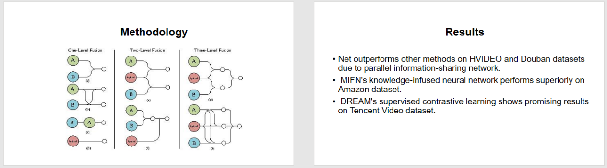

# Presentify

Welcome to the GitHub repository for the **Presentify_webapp** project! This repository is dedicated to optimizing and improving the process of developing presentation slides tailored for academic research papers within the domain of computer science. Users can submit research papers in PDF format, and the system will automatically generate concise and informative presentation slides based on the extracted content from these documents.


## Project Overview
The core functionality of this application revolves around leveraging advanced natural language processing (NLP) techniques to analyze and condense essential information from PDFs, identifying crucial points, thematic elements, and key concepts. The system intelligently organizes the extracted content into a coherent slide format, ensuring a systematic flow of information. The primary goal is to automate the labor-intensive task of manually constructing presentations, offering users a more efficient and user-friendly alternative within the context of academic research in computer science.

## Features
- **Text Extraction:** Utilizes PyMuPDF to extract text from uploaded research papers.
- **Section Extraction with Gemini:** Identifies and extracts sections like Introduction, Literature Review, Methodology, Results, and Conclusions.
- **Summarization with Fine-Tuned T5 Model:** Summarizes content extracted by Gemini into concise sentences.
- **Slide Generation:** Dynamically generates slides using Python pptx library based on T5 model summaries.

## Usage

To use the Presentify_webapp, follow these steps:
- **Prepare your research paper:** Ensure your research paper is in PDF format and is saved on your computer.
- **Upload the research paper:** Navigate to the Presentify_webapp website and click on the "Upload Research Paper" button. Select the PDF file from your computer and wait for the upload process to complete.
- **Wait for the slide generation:** Once the upload is complete, the system will automatically generate concise and informative presentation slides based on the extracted content from the research paper. This process may take a few moments, depending on the size of the paper.
- **Review and download the slides:** Once the slide generation is complete, you can review the slides on the website and download them as a PowerPoint presentation by clicking on the "Download Slides" button.
- **Customize the slides:** After downloading the slides, you can customize them further by adding images, charts, or any other visual aids that you may need.

*Note: The Presentify_webapp is designed to work with research papers in the computer science domain. You may need to modify the path.py and include your paths. If you encounter any issues or errors during the upload or slide generation process, please refer to the documentation for assistance.*

## Run Locally

Clone the project

```bash
  git clone https://github.com/yugratna19/Presentify_webapp.git
```

Install dependencies

```bash
  pip install -r requirements. txt
```

Start the server

```bash
  uvicorn main:app --reload
```

Now, open your web browser and navigate to http://localhost:8000 to view the application.
## Documentation

The proposal and the report of the project can be found in this [link](https://drive.google.com/drive/u/0/folders/1L4RpDFg88yW3ENWRD4jphHgqoCgmmVGc)


## Output





## Authors

- [@Atul Shreewastav](https://github.com/AtuLxCE)
- [@Bidhan Acharya](https://github.com/BidhanAcharya)
- [@Nischal Paudel](https://github.com/PaudelNischal)
- [@Yugratna Humagain](https://github.com/yugratna19)

Thank you for exploring the **Presentify_webapp** project repository! Feel free to contribute and enhance the automated presentation slide generation process.

